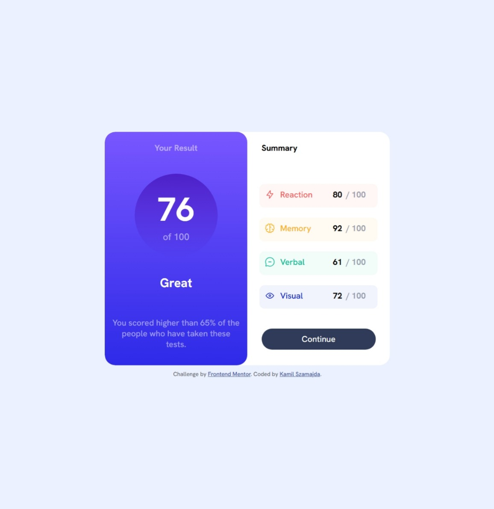

# Frontend Mentor - Results summary component solution

This is a solution to the [Results summary component challenge on Frontend Mentor](https://www.frontendmentor.io/challenges/results-summary-component-CE_K6s0maV). Frontend Mentor challenges help you improve your coding skills by building realistic projects. 

## Table of contents

- [Overview](#overview)
  - [The challenge](#the-challenge)
  - [Screenshot](#screenshot)
  - [Links](#links)
- [My process](#my-process)
  - [Built with](#built-with)
  - [Continued development](#continued-development)

## Overview
  This challange was done according to the instructions from Frontend Mentor. 
  Target, expected effect for comparison is in a design folder.

### The challenge

Users should be able to:

- See hover states for interactive elements
- See different layout on mobile devices

### Screenshot

### Links

- Solution URL: [See solution](https://www.frontendmentor.io/solutions/order-summary-using-css-flexbox-YPO12Iq4oT)
- Live Site URL: [See live site](https://marionmancer.github.io/order-summary/)

## My process

### Built with

- Semantic HTML5 markup
- CSS custom properties
- Flexbox
- Grid
- Mobile workflow

### Continued development

In this challenge, I applied the knowledge I gained during the Przyszły Programista course. While solving the task, I focused on using Flexbox, and in the future, I would like to dedicate more time to organizing my knowledge about it, as I believe there is still room for improvement in this area.

